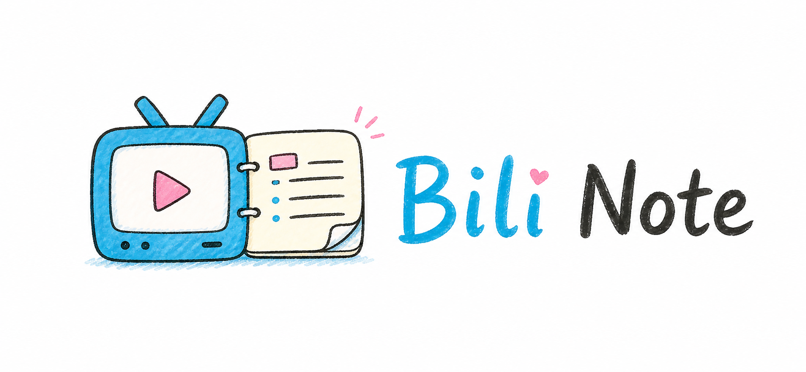

<p align="center">
  
</p>

<p align="center">
  
  
  
</p>

# Bili Note

Bili Note 是一个面向知识库的 B 站视频与图文笔记工具：完整归档字幕、图文正文、图片与评论，按内容信息量和质量动态控制笔记长度，把 B 站内容整理成可学习、可检索、可追问的 Markdown 笔记。

它的核心特点是：

- 完整归档：保存完整字幕、图文正文、图片、完整评论、元数据和证据索引，主笔记中的关键判断可以通过论文式编号链接回到原文位置复核。
- 动态长度：短视频和长课程根据内容信息量与结构采用不同的提炼粒度。
- 质量感知：结合内容热度、互动质量、评论讨论度和发布时间等信号调整笔记预算，让更值得深读的内容获得更充分的整理。
- 写前定标：先根据原始材料生成推荐字数、压缩比和写作粒度，再开始写笔记；写后评分只用于验收和微调。
- 字幕密度提醒：长视频如果字幕/转写明显稀疏，会提醒你需要关键帧、OCR 或多模态视觉理解，避免把不完整文本写成完整课程笔记。
- 关键帧视觉理解：视频每次运行前询问用户是否开启；开启后先用最多 12 帧组成 4×3 联系图，再按需查看单帧，控制视觉输入 tokens。

它的目标是生成一份“学完这节课或读完这篇教程之后真的有收获”的学习型笔记，内容深度由原始材料的信息量和结构决定。

## 适合什么

- B 站技术视频、课程、观点视频、多 P 系列课和图文/动态/opus 长文。
- 需要长期保存字幕、正文、图片、评论和证据索引的知识库。
- 需要人类阅读、Agent 检索和后续问答的学习材料。

## 输出内容

一次完整提取会生成主笔记和原始材料包。主笔记依据材料预算组织学习收获、概念、方法、实践清单和证据位置；材料包保存字幕或图文正文、图片、评论、元数据、索引、预算和评分结果。

<details>
<summary>展开完整输出清单</summary>

主笔记通常包含：知识地图、概念卡、方法流程、关键洞察、实践清单、坑点、自测题和证据脚注。

原始材料包通常包含：完整正文和字幕、图片、评论、元数据、JSONL 索引、预算、评分，以及用户开启关键帧后生成的联系图和视觉证据。

</details>

## 快速使用

### 1. 安装

把下面这句话发给 Agent：

```text
请帮我安装这个 skill：
https://github.com/Rimagination/bili-note
```

### 2. 提取视频或图文

在 B 站视频页点击分享，复制视频链接，然后把下面这句话发给 Agent：

```text
请帮我提取这个视频的内容：https://www.bilibili.com/video/BVxxxx/
```

如果也想提取评论区里的有用内容，可以说：

```text
请帮我提取这个视频的内容和评论区有用的内容：https://www.bilibili.com/video/BVxxxx/
```

图文/动态/opus 链接也一样：

```text
请帮我提取这个 B 站图文的内容：https://www.bilibili.com/opus/1194341967364882439
```

需要评论区时可以说：

```text
请帮我提取这个 B 站图文的内容和评论区有用的内容：https://www.bilibili.com/opus/1194341967364882439
```

视频每次运行前，Agent 会询问是否开启关键帧视觉理解。选择开启会额外消耗视觉输入 tokens，但能补充 PPT、板书、代码、界面和无字幕片段的信息；选择关闭会继续使用字幕、转写、评论和元数据路线。

### 3. 指定保存位置

如果你有固定文件夹，或者想保存到 Obsidian 知识库里，再加一句保存路径：

```text
帮我存放在：“D:\知识库\B站总结” 里
```

## 依赖与环境检测

第一次使用、换机器、字幕路线失败，或准备转写音频前，先让 Agent 检查环境：

```text
请帮我检查 Bili Note 的运行环境，并告诉我当前能走公开字幕、网页 AI 字幕、中文 Qwen3-ASR 还是 Whisper 兜底。
```

Agent 会运行：

```powershell
python scripts/check_environment.py
```

依赖按能力分层：

| 能力 | 依赖 |
| --- | --- |
| 基础提取 | Python 3.10+、B 站网络访问 |
| 网页 AI 字幕 | 已登录的 Chrome + `web-access`，或远程调试的 Edge |
| 中文转写 | `ffmpeg`、共享 Qwen3-ASR 环境 |
| 外语转写 | `ffmpeg`、Whisper / faster-whisper |
| 下载兜底 | `yt-dlp` |
| 关键帧理解 | `ffmpeg`、可访问的视频流、视觉模型 |

Bili Note 与 DyNote 会复用 `%USERPROFILE%\.cache\rimagination-notes` 下的模型和 Qwen3-ASR 环境。普通使用无需安装全部增强依赖，环境缺失时会跳过对应路线并说明覆盖范围。

默认策略：B 站公开视频优先走公开字幕和网页 AI 字幕；确实需要音频转写时，中文或未指定语言的视频优先 Qwen3-ASR，明确是外语视频时优先 Whisper 系后端。需要手动指定时，可以用 `--asr-backend qwen3-asr` 或 `--asr-backend faster-whisper`。

## 字幕很少怎么办

Bili Note 默认优先用字幕。长视频字幕/转写明显稀疏时，画面可能包含 PPT、板书、代码、软件操作或无解说片段，预算文件会记录画面依赖提示。

每次视频运行先做轻量预检，再强制询问是否开启关键帧理解。开启后最多抽取 12 帧，先生成 4×3 联系图，再按需查看单帧；关闭后继续使用字幕、转写、评论和元数据路线。当前模型不能看图时，Agent 会说明覆盖范围。

预检结果保存在 `visual_preflight.json`。开启关键帧后，工作目录会生成联系图、单帧和 `keyframes_manifest.json`；归档后对应文件位于 `metadata/`，视觉观察写入 `metadata/visual_review.md`。

## 登录和隐私

网页 AI 字幕支持 Chrome `web-access` 和 Edge Chromium DevTools Protocol。两条路线都让已登录的 B 站页面自己请求字幕接口；Bili Note 不读取、不导出、不保存 Cookie、localStorage、浏览器 profile 或登录 token。没有浏览器登录态时，会改用公开字幕、正文、评论或音频转写，并说明覆盖范围。

Edge 需要用远程调试端口启动一个独立实例，并在该实例中登录 B 站。Windows PowerShell 示例：

```powershell
$edge = "${env:ProgramFiles(x86)}\Microsoft\Edge\Application\msedge.exe"
$profile = Join-Path $env:LOCALAPPDATA "bili-note-edge-profile"
& $edge --remote-debugging-port=9222 --user-data-dir="$profile" "https://www.bilibili.com/"
```

首次使用时在这个 Edge 实例中登录 B 站，再运行总入口并指定 `--browser edge`。默认端口为 `9222`，可用 `--edge-cdp-url` 修改；另需安装 `websocket-client`：`python -m pip install websocket-client`。

## 写笔记的原则

- 先讲学习目标、方法和迁移方式，再补充原内容。
- 课程按学习模块组织，观点按背景、判断、论据和适用边界组织。
- 技术教程保留架构、配置、操作步骤、评估方式和排错路径。
- 评论区只保留纠错、案例、实践经验、替代方案和争议点。
- 写作前读取 `metadata/note_budget.json`，写作后用评分结果验收；关键判断使用 `[1][2]` 等编号链接到证据。

## 相关文件

- `SKILL.md`：完整工作流说明。
- `scripts/run_bili_note.py`：一键运行视频/图文提取、评论、归档和证据索引。
- `scripts/check_environment.py`：检查可用的字幕、浏览器、转写和测试路线。
- `scripts/extract_video_keyframes.py`：生成最多 12 张代表帧和联系图。
- `scripts/fetch_browser_ai_subtitles.py`、`scripts/edge_cdp.py`：获取网页 AI 字幕。
- `scripts/archive_bili_materials.py`、`scripts/score_bili_note.py`：归档材料并验收笔记。

## 社区友链

- [LINUX DO](https://linux.do/)：一个关注开发者、开源项目与 AI 工具交流的社区。感谢社区佬友对开源工具和 Agent 工作流的讨论与反馈。

## 致谢

Bili Note 的设计和实现参考、依托了这些主要项目与生态：

- [Bilibili](https://www.bilibili.com/)：视频、字幕、评论和互动数据来源。
- [yt-dlp](https://github.com/yt-dlp/yt-dlp)：可选音频下载兜底。
- [FFmpeg](https://ffmpeg.org/)：可选音频转码。
- [Qwen3-ASR](https://huggingface.co/Qwen/Qwen3-ASR-0.6B)：可选中文本地自动语音识别后端。
- [OpenAI Whisper](https://github.com/openai/whisper)、[faster-whisper](https://github.com/SYSTRAN/faster-whisper)、[FunASR](https://github.com/modelscope/FunASR)：可选外语视频转写后端。

## 许可证

本项目使用 MIT License，详见 `LICENSE`。
